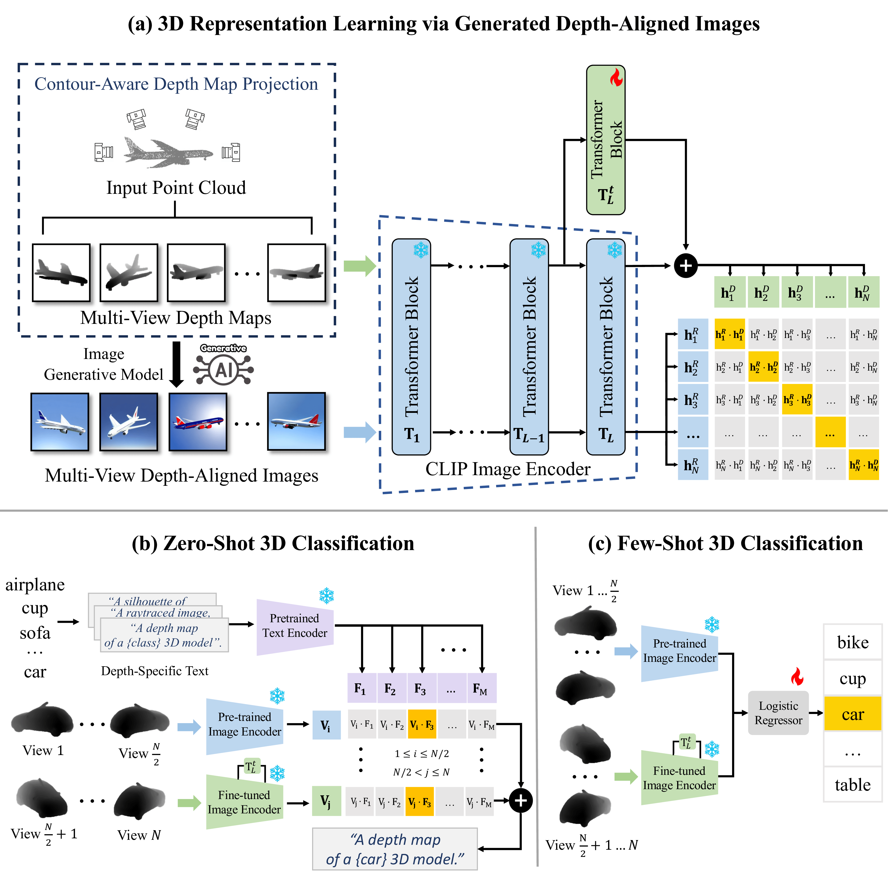

# OpenDlign: Enhancing Open-World 3D Learning with Depth-Aligned Images
[Project Website](https://Yebulabula.github.io/OpenDlign/)

[***News***] [23/06/2024] OpenDlign pre-trained models and datasets have been released. 🔥🔥🔥

[23/06/2024] The OpenDlign paper is released on Arxiv. 🔥🔥🔥

Official implementation of [OpenDlign: Enhancing Open-World 3D Learning with Depth-Aligned Images](https://arxiv.org/abs/2404.16538)


**Overview of OpenDlign.** In (**a**), OpenDlign converts point clouds into multi-view depth maps using a contour-aware projection, which then helps generate depth-aligned RGB images with diverse textures, geometrically and semantically aligned with the maps. A transformer block, residually connected to the CLIP image encoder, is fine-tuned to align depth maps with depth-aligned images for robust 3D representation. For zero-shot classification (**b**), OpenDlign aggregates multi-view logits from both pre-trained and fine-tuned encoders for label prediction and for few-shot classification (**c**), it employs a logistic regressor trained on multi-view features from the encoders.
## Project Summary
OpenDlign is a multimodal framework for learning open-world 3D representations. It leverages depth-aligned images generated from point cloud-projected depth maps. Unlike CAD-rendered images, our generated images provide rich, realistic color and texture diversity while preserving geometric and semantic consistency with the depth maps. Our experiments demonstrate OpenDlign's superior performance in zero-shot and few-shot classification, 3D object detection, and cross-modal retrieval, especially with real-scanned 3D objects.

## Install environments
We pre-train OpenDlign on 1 Nvidia A100 GPU, the code is tested with CUDA==11.3 and pytorch==1.11.0
```
conda create -n OpenDlign python=3.8
conda activate OpenDlign
conda install pytorch==1.11.0 torchvision==0.12.0 torchaudio==0.11.0 cudatoolkit=11.3 -c pytorch
pip install -r requirements.txt
```

## Datasets
The processed evaluation data (i.e., ModelNet40, ScanObjectNN, OmniObject3D) can be found [here](https://huggingface.co/datasets/OpenDlign/OpenDlign-Datasets)

## Pretrained Models
The pre-trained OpenDlign models, which are integrated with various CLIP variants (e.g., ViT-H-14, ViT-L-14, ViT-B-16, ViT-B-32), are available [here](https://huggingface.co/OpenDlign/OpenDlign-Models)

## Inference
Update the root path of your downloaded evaluation dataset before running the following command:

```bash scripts/zero_shot.sh```

## Training
Update the root path of your downloaded training dataset before running the following command:

```bash scripts/model_training.sh```

## Citation

If you find our code is helpful, please cite our paper:

```
@article{ye2023opendlign,
  title={OpenDlign: Enhancing Open-World 3D Learning with Depth-Aligned Images},
  author={Ye Mao and Junpeng Jing and Krystian Mikolajczyk},
  year={2024}
}
